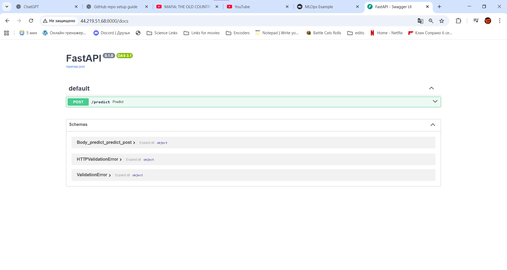
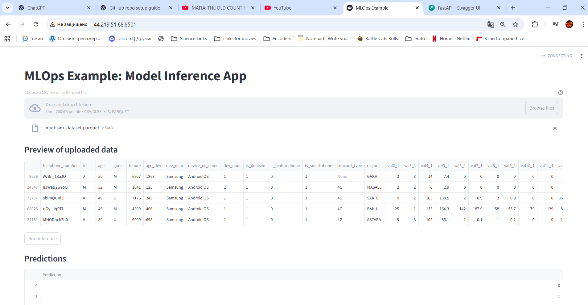

# MLOps Example


[](https://opensource.org/licenses/Apache-2.0)
[](https://shields.io/)

---

## Overview of the Project

This repository demonstrates a simple MLOps pipeline example created for the DataMinds bootcamp. It showcases how to build, dockerize, and deploy a machine learning application with service communication, along with implementing CI/CD workflows using GitHub Actions and self-hosted runners.

## Architecture

- **Backend**: FastAPI for ML model serving and API endpoints
- **Frontend**: Streamlit for interactive web interface
- **Containerization**: Docker and Docker Compose for service orchestration
- **CI/CD**: GitHub Actions with self-hosted runner deployment

## Quick Start

### Prerequisites

- Docker and Docker Compose installed
- Git

### Running the Application

1. **Clone the repository**
   ```bash
   git clone https://github.com/Elkhn/MLOps_example.git
   cd MLOps_example
   ```

2. **Launch services with Docker Compose**
   ```bash
   docker-compose up -d
   ```

3. **Access the application**
   - Frontend (Streamlit): `http://localhost:8501`
   - Backend API (FastAPI): `http://localhost:8000`
   - API Documentation: `http://localhost:8000/docs`

4. **Stop the application**
   ```bash
   docker-compose down
   ```

## Project Structure

```
MLOps_example/
├── backend/              # FastAPI application
├── frontend/             # Streamlit application
├── docker-compose.yml    # Service orchestration
├── .github/workflows/    # CI/CD pipelines
└── README.md
```

## Development Setup

### For Server Deployment (Ubuntu)

1. **Add user to docker group** (to run docker commands without sudo)
   ```bash
   sudo usermod -aG docker ubuntu
   ```

2. **Create GitHub self-hosted runner**
   - Go to your repository **Settings** → **Actions** → **Runners**
   - Click **"New self-hosted runner"** and select **Linux**
   - Follow all the setup steps provided by GitHub **except the last step**
   - Don't run `./run.sh` directly as shown in GitHub instructions

3. **Launch GitHub runner in detached mode**
   ```bash
   nohup ./run.sh > runner.log 2>&1 &
   ```

## Key Features

- **Dockerized Services**: Both backend and frontend are containerized for consistent deployment
- **Service Communication**: Demonstrates proper inter-service communication patterns
- **CI/CD Pipeline**: Automated testing and deployment using GitHub Actions
- **Self-hosted Runner**: Shows how to set up and use self-hosted runners for deployment
- **Learning Playground**: Intended for exploring and practicing MLOps concepts

## License

This project is licensed under the Apache License 2.0 - see the [LICENSE](https://opensource.org/licenses/Apache-2.0) file for details.

---

*This is a educational example project demonstrating MLOps best practices. For production use, consider additional security, monitoring, and scalability measures.*

**Made with ❤️ for DataMinds'25 students**


# ML Ops Project HW 2 Continue

End-to-end ML service with **FastAPI** (backend) + **Streamlit** (frontend), containerized with **Docker** and deployed on **AWS EC2** via a GitHub Actions **self-hosted runner**.  

---

## Live Deployment  

- **Frontend (Streamlit):** [http://44.219.51.68:8501](http://44.219.51.68:8501)  
- **Backend (FastAPI Docs):** [http://44.219.51.68:8000/docs](http://44.219.51.68:8000/docs)  

---

## Features  

- **Backend (FastAPI)**  
  - `/health` endpoint → returns service status.  
  - `/predict` endpoint → accepts uploaded CSV/Excel files, returns predictions.  

- **Frontend (Streamlit)**  
  - Drag-and-drop UI for uploading CSV/Excel files.  
  - Shows file preview, calls backend for predictions, displays results.  

- **DevOps**  
  - Docker Compose orchestrates backend + frontend.  
  - GitHub Actions with linting + deploy jobs.  
  - Self-hosted runner on EC2 for CI/CD automation.  

---

## Setup  

### Local (with Docker Compose)  
```bash
docker compose up -d --build

docker ps --format "table {{.Names}}\t{{.Ports}}"

EC2 Deployment (via GitHub Actions runner)

Every push to main triggers the deploy workflow and restarts containers on the EC2 instance.
Backend → http://44.219.51.68:8000/docs
Frontend → http://44.219.51.68:8501

## Screenshots

### Backend Swagger (`/docs`)
Here is the automatically generated API documentation from FastAPI:



---

### Frontend Streamlit
The Streamlit app allows the user to send inputs and view predictions interactively:



